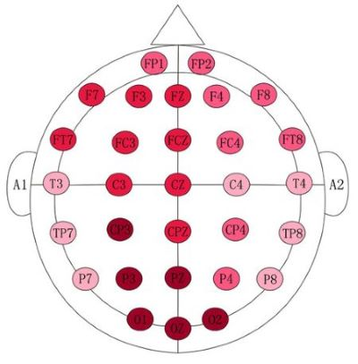
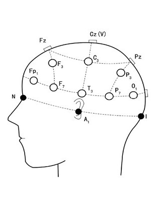

# Neurosity

 

## [Made by TechIsen with Neurosity headset](https://docs.neurosity.co/)

[Doc for the server :](https://docs.neurosity.co/docs/getting-started)
# 

 

Get info and act : 
- [ ] Server node
- [ ] Test with exemple
- [ ] Verification (connection, set...)
- [ ] Make profiles
- [ ] Analyse signaux

## File:

* In `Headset _ Control`
  * `setup`  to install node, npm and @neurosity.
  * `.env` contains ID settings
  * `index.js` contains server launch and the main code.

* `Unity_Viewer`
  * `TECH_ISEN_HAND` contains hand modelisation

 

## Some Notion : 
***
### Brain Wave:

This headset detect brain waves. There come from the communication between our cells, more specifically when a group of neurons send a message to another group. This detection as for unit Hz. There are five types of brain wave :

* **DELTA** : it is the slowest brain wave type. They are produced when we are in the deepest sleep state (when we don't have any dream). `0.5 and 4 Hz`
* **THETA** : when you are sleeping more or when you are extremely relaxed. `4Hz and 8 Hz`
* **ALPHA** : there are produce when you are awake, but not focusing on something. They are communicating automatic action. `8 and 12 Hz`
* **BETA** : when you are awake, alert and focus, for example when you make a decision.  `12Hz and 35 Hz`
* **GAMMA** : when you are actively learning, concentrating and solving `up to 35 Hz`

[SRC](https://www.healthline.com/health/alpha-brain-waves#different-types-of-brain-waves)

***
### EGG:
An electroencephalogram (EEG) is a test used to evaluate the electrical activity in the brain. Brain cells communicate with each other through electrical impulses. An EEG can be used to help detect potential problems associated with this activity.

*** 
### Brain area : 

[SRC](https://www.healthline.com/health/alpha-brain-waves#different-types-of-brain-waves)
***

To complete : [Study 1](.dist/symmetry-13-01746.pdf)   [Study 2](https://www.ncbi.nlm.nih.gov/pmc/articles/PMC5591875/)